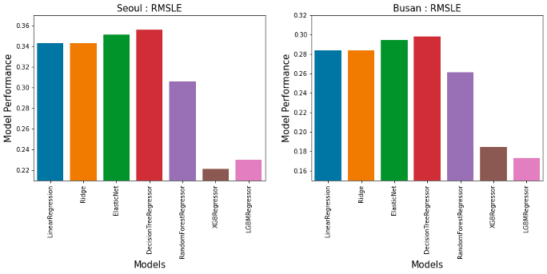
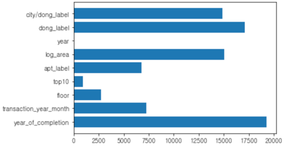

# **transaction-price-project**

서울과 부산의 아파트 값을 예측한다.  

 
 
 

# **목차**

## [0. 사용 데이터](#0-사용-데이터)
## [1. 데이터 전처리](#1-데이터-전처리)  
## [2. 특성 선택](#2-특성-선택)  
## [3. 모델 훈련](#3-모델-훈련)  
## [4. 파라미터 최적화](#4-파라미터-최적화)  
## [5. 모델 합치기](#5-모델-합치기)  

 
 
 

# **0. 사용 데이터**

1. tran.csv
2. test.csv
3. park.csv
4. day_care_center.csv
5. 서울_행정구역_경계.json
6. 부산_행정구역_경계.json
7. 서울시_소득분위.xls

 
 

## **train.csv, test.csv**
<table border='1'>
<thead border='2'>
<tr>
<td>컬럼명</td><td>컬럼 설명</td>
</tr>
</thead>
<tbody>
<tr><td>apartment_id</td><td>아파트 아이디</td></tr>
<tr><td>city</td><td>도시(서울특별시, 부산광역시)</td></tr>
<tr><td>dong</td><td>동(주소)</td></tr>
<tr><td>jibun</td><td>지번(주소)</td></tr>
<tr><td>apt</td><td>아파트단지 이름</td></tr>
<tr><td>addr_kr</td><td>주소</td></tr>
<tr><td>exclusive_use_area</td><td>전용면적</td></tr>
<tr><td>year_of_completion</td><td>설립일자</td></tr>
<tr><td>transaction_year_month</td><td>거래년월</td></tr>
<tr><td>transaction_date</td><td>거래날짜</td></tr>
<tr><td>floor</td><td>층</td></tr>
<tr><td>transaction_real_price</td><td>실거래가</td></tr>
</tbody>
</table>

 
 

## **park.csv**
<table border='1'>
<thead border='2'>
<tr>
<td>컬럼명</td><td>컬럼 설명</td>
</tr>
</thead>
<tbody>
<tr><td>city</td><td>도시(서울특별시, 부산광역시)</td></tr>
<tr><td>gu</td><td>지번(주소)</td></tr>
<tr><td>dong</td><td>동(주소)</td></tr>
<tr><td>park_name</td><td>공원 이름</td></tr>
<tr><td>park_type</td><td>공원 종류</td></tr>
<tr><td>park_area</td><td>공원 넓이</td></tr>
<tr><td>park_exercise_facility</td><td>공원 보유 운동시설</td></tr>
<tr><td>park_entertrainment_facility</td><td>공원 보유 유희시설</td></tr>
<tr><td>park_benefit_facility</td><td>공원 보유 편의시설</td></tr>
<tr><td>park_cultural_facility</td><td>공원 교양시설</td></tr>
<tr><td>park_facility_other</td><td>공원 보유 기타시설</td></tr>
<tr><td>park_open_year</td><td>개장년도</td></tr>
<tr><td>reference_date</td><td>데이터 기준 일자</td></tr>
</tbody>
</table>

 
 
 

# **1. 데이터 전처리**
***
## 1-1. 지역구 정보 가져오기

  데이콘에서 받은 데이터들 중에 결측값이 있는 지 파악한다.
## 1-2. 아파트 이름 데이터 정제!

 

<li>아파트 이름을 나누는 이유는 유명 브랜드는 타 아파트에 비해 가격이 비싸다는 생각이 있다.</li>
<li>아파트를 나누기 전에 훈련 데이터 '(', ',', '[', ']' 기호들이 들어있기에 불필요한 문자는 삭제해 준다.</li>
<li>ex )타워팰리스(106동) -> 타워 팰리스</li>

## 1-3. 실거래가 & 면적 LOG 표준화

<li>로그는 태생적으로 큰 값을 작게 표시되는 고안 방법이다.</li>
<li>측정 단위를 키우는 것만으로는 해결하지 못한 부분을 해결 가능하다.</li>
<li>변수의 측정하는 단위가 매우 작아서 생기는 문제를 해결하고 해석할 수 있다.</li>
<li>실거래가를 표준화 하여 Log_Price 컬럼에 저정한다.</li>
<li>면적 또한 똑같은 방법으로 진행하고 LOG_price 컬럼에 저장한다.</li>
 

## 1-4. 각 자치구 '동'을 '구'로 변경(서울 / 부산)

<li>현재 데이터들에는 '동'에 대한 데이터는 있지만, '구'에 대한 데이터가 없다.</li>
<li>공공데이터 포털에서 서울시, 부산시 자치구에 대한 데이터를 가져와 포함시킨다.</li>

## 1-5. 구 & 동 주소 라벨 인코딩

<li>자치구은 아파트 집값에 많은 양향을 끼친다고 판단했다.</li>
<li>데이터들을 분석하기 위해 인코딩을 진행해야 한다.</li>

# **2. 특성 선택**
## 1.train 데이터의 상관계수!

<li>서울의 상관계수를 파악한 결과이다</li>
<li>데이터에 대한 중요 결합을 안했기 때문에 면접만이 중요한 수치로 판단된다.</li>

## 2. 이상치값 판단

 

<li>매년 집값은 변화기 때문에 평균 값을 측정하기는 어렵다.</li>

## 3. 월 단위 집 값

<li>물량이 많은 2월 ~ 3월 가격이 떨어진다.</li>
<li>거래 날짜가 많이 없는 9월 ~ 12월에는 가격이 올라간다.</li>
<li>물량에 따라 가격이 많이 움직이다.</li>

## 4. 연도 단위 집값

<li>경제에 대한 영향을 많이 받는다.</li>
<li>2008년에는 금융 위기로 집값이 많이 내려간 것을 확인 할 수 있다.</li>
<li>08년도 이후 시간이 지날수록 회복하는 모습을 보인다.</li>

## 5. 서울 상관계수 - '자치구, 동'

<li>상관계수를 분석하기 전 ’구’와 ‘동’은 실거래가와 큰 관련이 있을 것이라 예측하였다.</li>
<li>상관계수를 보아 ‘구’와 ‘동’은 실거래가와 큰 관련이 없다.</li>
<li>실제로는 자치구에 비례하는 ‘편의시설’, ‘교육’ 등 다수와 관련을 지어야 정확한 상관계수를 측정할 수 있다 </li>

## 6. 부산 상관계수 - '자치구, 동'

<li>상관계수를 분석하기 전 ’구’와 ‘동’은 실거래가와 큰 관련이 있을 것이라 예측하였다.</li>
<li>상관계수를 보아 ‘구’와 ‘동’은 실거래가와 큰 관련이 없다.</li>
<li>실제로는 자치구에 비례하는 ‘편의시설’, ‘교육’ 등 다수와 관련을 지어야 정확한 상관계수를 측정할 수 있다 

## 7. 서울 & 부산 자치구의 거래량

<li>서울은 노원구 > 강동구 > 강남구 순으로 거래가 많이 이루어진다.</li>
<li>부산은 해운대구 > 부산진구 > 북구 순으로 거래가 많이 이루어진다.</li>
<li>결국 상위 3개를 분석해본 결과 해당 지역들은 집값이 싸거나, 교육 인프라가 상대적으로 많이 구비된 곳임을
확인하였다.</li>

## 8. 서울 자치구의 거래날짜 시각화

<li>서초구, 강남구, 용산구 순으로 높은 가격대를 유지하고 있다.</li>
<li>2008년에는 가격이 다소 낮아졌지만 시간이 지날수록 모든 자치구의 거래 가격이 상승되고 있다.</li>

## 9. 부산 자치구의 거래 날짜 시각화

<li>서울과 비슷하지만 상대적으로 다소 내려가는 추세이다.</li>
<li>인구가 점점 빠지면서 비 수도권에서는 가격의 추이가 급등하는 그래프는 아닌 것을 할인할 수 있었다.</li>

## 10. 주소 상관 계수

<li>서울은 각 해당하는 주소의 편차가 매우 크기 때문에 유믜미한 상관계수를 찾기 힘들다.</li>
<li>부산은 편차가 작고 이상치 값이 많이 없기 때문에 0.13 이라는 상관계수를 파악할 수 있었다.</li>

## 11. 서울, 부산 실거래가 시각화

<li>서울은 각 해당하는 주소의 편차가 매우 크기 때문에 유의미한 상관계수를 찾기 힘들다.</li>
<li>부산은 편차가 작고 이상치 값이 많이 없기 때문에 0.13이라는 상관계수를 파악할 수 있었다.</li>

## 12. 공원의 개수를 train 데이터와 결합

<li></li>
<li></li>
<li></li>

## 13. 서울 공원의 상관 계수

## 14. 부산 공원의 상관 계수

<li>공원읜 개수는 상관계수가 유의미한 지표로 나온다.</li>
<li>공원의 면접은 중요하지 않는 것을 확인할 수 있다.</li>

## 15. 서울 소득 분위 (공공데이터 포털)

<li>현재 데이터만으로는 정확한 분석이 불가능하기에, 해당 자치구의 소득 분위 데이터를 사용해 접목시킨다.</li>

## 16. 부산 소득 분위 (공공데이터 포털)

<li>현재 데이터만으로는 정확한 분석이 불가능하기에, 해당 자치구의 소득 분위 데이터를 사용해 접목시킨다.</li>
<li>소득 분위가 높은 자치구(행정구) 일수록 아파트의 가격은 점점 올라간다</li>

## 17. 소득 분위 상관 계수(공공데이터 포털)

<li>서울은 지역내에서 소득분위에 따라 아파트 가격에 영향을 많이 주는 것을 확인할 수 있다.</li>
<li>부산은 지역마다 가격 분포가 일정하기 때문에 상관 계수는 거의 의미가 없는 것을 확인할 수 있다.</li>

## 18. 설립 연도에 따른 집값 추이

<li>서울의 경우 1970년도에 지어진 건물들은 재건축을 하기에 가격이 폭등하는 모습을 확인할 수 있다.</li>
<li>부산은 재건축 보다는 신축 건물들의 가격이 높은 것을 확인할 수 있다.</li>

## 19. 집 면적에 따른 가격 추이

<li>아파트 면접에 따라 가격도 상승하는 것을 확인할 수 있다.</li>

## 20. 아파트 층 수에 따른 가격 추이

<li>층 수가 높을 수 록 가격이 상승되는 것을 확인할 수 있다.</li>

 

# **3. 특성 선택**

## 1. 모델 특성 선택하기

<li>모델 특성을 선택하기 위해 상관계수를 파악하여 필요한 특성을 선택한다.</li>
<li>LOG_price 상관계수가 0 보다 작은 컬럼은 삭제한다.</li>

# **4. 모델 훈련**

## 1. 서울 모델 학습 결과

<li>서울은 tree 기반들이 전체적으로 RMSE 값이 낮은 것을 확인할 수 있다.</li>
<li>서울 XGB 모델을 사용한다.</li>

## 2. 부산 모델 학습 결과

<li>부산은 LGB 기반이 낮은 것을 확인 할 수 있다.</li>

## 3. 모델 평균값 비교하기

<li>서울은 XGB 모델을 사용해 grid search를 실행한다.</li>
<li>부산은 LGB 모델을 사용해 grid serach를 사용한다.</li>

 
 

# **5. 파라미터 최적화**

## 1. 모델 최적화

<li>하이퍼파라미터 튜닝에 사용되고 있는 Automi 기법</li>
<li>빠르게 튜닝이 가능하다는 장점을 가지고 있음.</li>

## 2. 모델 결과

<li>서울 모델 결과 : Best Score : 0.1107.</li>

<li>부산 모델 결과 : Best Score : 0.1336</li>

## 3-1. 서울 훈련한 데이터 결과 시각화

## 3-2. 서울 결과

<li>소득 분위가 가장 많은 영향을 미치고</li>
<li>아파트의 면적, TOP10 아파트가 중요하다는 것을 알 수 있다.</li>

## 4-1. 부산 훈련한 데이터 결과 시각화

## 4-2. 부산 결과

<li>건축 연도가 가장 중요하다는 것을 알 수 있다.</li>
<li>지역(동)과 면적의 중요도가 높다는 것을 확인할 수 있다.</li>

 
 

# 5. 최종

